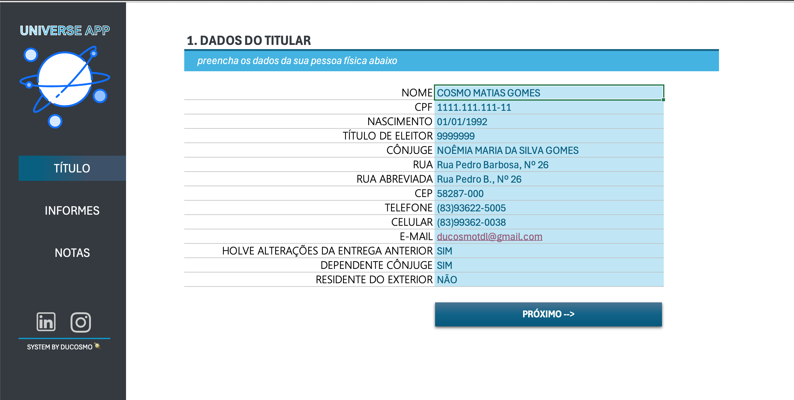
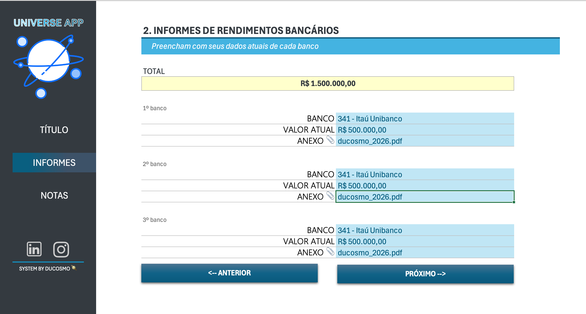
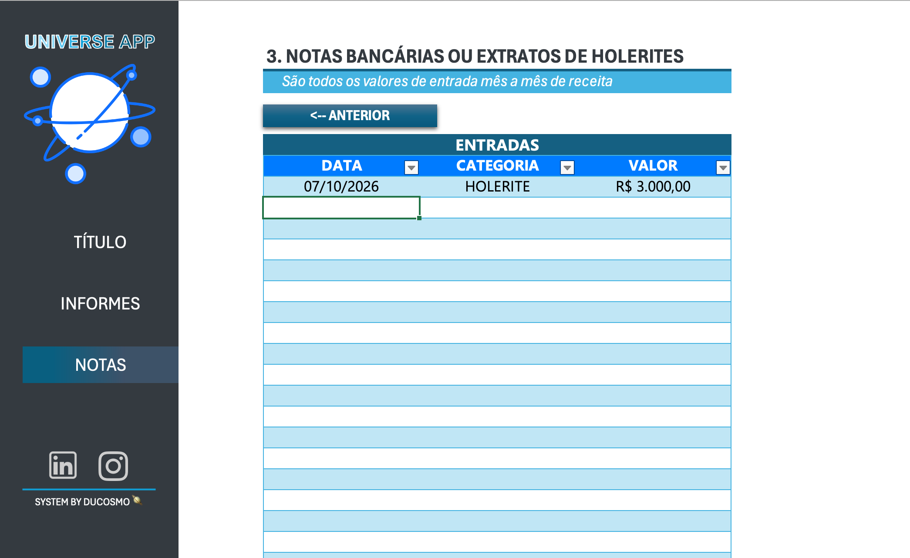

# 🌌 Universe App — Organizador para Declaração de Imposto de Renda


Projeto desenvolvido como parte de um desafio da **DIO**, com o objetivo de aplicar conhecimentos de Excel na criação de uma ferramenta prática para **organizar informações importantes utilizadas na declaração de Imposto de Renda**.

O **Universe App** centraliza dados pessoais, informações bancárias e registros de receitas em uma interface organizada e de fácil utilização.

---

## 📌 Sobre o desafio

O objetivo do projeto foi desenvolver uma solução em Excel capaz de reunir e organizar informações essenciais para a declaração de Imposto de Renda.

A proposta envolve a utilização de recursos como:

- organização e estruturação de dados;
- fórmulas;
- validação de dados;
- listas suspensas;
- formatação de células;
- navegação entre diferentes áreas;
- automatização de cálculos;
- criação de uma interface amigável.

---

## 🎯 Objetivo do projeto

O **Universe App** foi criado para facilitar o armazenamento e a consulta de informações que normalmente precisam ser reunidas durante o período de declaração do Imposto de Renda.

A ferramenta foi dividida em áreas específicas para permitir que o usuário registre:

- dados pessoais do titular;
- informações bancárias;
- valores disponíveis em instituições financeiras;
- documentos relacionados aos informes;
- receitas recebidas;
- holerites e outras entradas financeiras.

---

## 🖥️ Interface

### 👤 Dados do Titular

Área destinada ao cadastro das principais informações pessoais necessárias para organização da declaração.



Entre os campos disponíveis estão:

- Nome;
- CPF;
- Data de nascimento;
- Título de eleitor;
- Cônjuge;
- Endereço;
- CEP;
- Telefone;
- Celular;
- E-mail;
- Alterações em relação à declaração anterior;
- Dependência do cônjuge;
- Residência no exterior.

Alguns campos utilizam **listas suspensas**, facilitando o preenchimento e diminuindo erros de digitação.

---

### 🏦 Informes de Rendimentos Bancários

Nesta área podem ser cadastradas informações referentes às instituições financeiras utilizadas pelo contribuinte.



Para cada banco é possível registrar:

- instituição financeira;
- valor atual;
- nome ou referência do documento anexado.

A ferramenta também realiza automaticamente o cálculo do **valor total informado entre as instituições financeiras cadastradas**.

---

### 💰 Notas Bancárias e Holerites

Área criada para registrar as entradas financeiras recebidas ao longo do período.



Cada lançamento contém:

| Campo | Descrição |
|---|---|
| 📅 Data | Data em que o valor foi recebido |
| 🏷️ Categoria | Tipo de entrada financeira |
| 💵 Valor | Valor correspondente à entrada |

A utilização de listas suspensas auxilia na padronização das categorias e melhora a organização dos registros.

---

## ⚙️ Funcionalidades

O projeto utiliza diferentes recursos do Microsoft Excel para tornar o preenchimento mais organizado e intuitivo:

- ✅ Interface personalizada;
- ✅ Menu lateral organizado por seções;
- ✅ Cadastro de dados pessoais;
- ✅ Cadastro de informações bancárias;
- ✅ Registro de documentos relacionados aos bancos;
- ✅ Registro de entradas financeiras;
- ✅ Listas suspensas;
- ✅ Validação de dados;
- ✅ Formatação personalizada de CPF, CEP, telefone e valores monetários;
- ✅ Cálculos automáticos;
- ✅ Soma automática dos valores bancários;
- ✅ Planilha auxiliar para armazenamento da lista de instituições financeiras;
- ✅ Organização visual das áreas de preenchimento;
- ✅ Separação das informações em diferentes planilhas.

---

## 🗂️ Estrutura da planilha

O arquivo é organizado nas seguintes abas:

```text
Universe_app.xlsx
│
├── TITULAR
│   └── Cadastro dos dados pessoais do contribuinte
│
├── INFORMES
│   └── Informações e valores das instituições financeiras
│
├── NOTAS
│   └── Registro de entradas, holerites e outras receitas
│
└── TABELAS
    └── Dados auxiliares utilizados nas listas e validações
```

---

## 🧮 Automatizações utilizadas

Um dos recursos implementados foi o cálculo automático do total dos valores registrados nas instituições financeiras.

Exemplo de fórmula utilizada:

```excel
=SUM(D11,D16,D21)
```

Dessa forma, ao alterar os valores informados nos bancos, o valor total também é atualizado automaticamente.

Também foram utilizadas **validações de dados e listas suspensas** para padronizar determinadas informações e facilitar o preenchimento.

---

## 🛠️ Tecnologias e recursos utilizados

- Microsoft Excel;
- Fórmulas;
- Validação de Dados;
- Listas Suspensas;
- Formatação de células;
- Formatação monetária;
- Formatação personalizada;
- Elementos gráficos e formas;
- Organização de dados;
- Git;
- GitHub;
- Markdown.

---

## 🚀 Como utilizar

1. Faça o download ou clone este repositório.

```bash
git clone URL_DO_SEU_REPOSITORIO
```

2. Abra o arquivo:

```text
Universe_app.xlsx
```

3. Utilize o menu lateral para acessar as diferentes áreas da ferramenta.

4. Preencha os dados do titular.

5. Cadastre os informes das instituições financeiras.

6. Registre as entradas financeiras e holerites.

7. Consulte os dados sempre que necessário durante a organização da declaração.

---

## 📂 Estrutura sugerida do repositório

```text
universe-app/
│
├── imagens/
│   ├── desafio-dio.png
│   ├── tela-titular.png
│   ├── tela-informes.png
│   └── tela-notas.png
│
├── Universe_app.xlsx
│
└── README.md
```

---

## 🔐 Observação sobre os dados

Os dados apresentados nas imagens deste repositório são **fictícios e utilizados apenas para demonstração da ferramenta**.

Ao utilizar o projeto com informações reais, é importante evitar a publicação de dados pessoais, financeiros ou documentos confidenciais em repositórios públicos.

---

## 💡 Aprendizados

O desenvolvimento deste projeto permitiu colocar em prática diversos conceitos relacionados ao Excel e à organização de informações.

Durante a construção da ferramenta, foram trabalhados conhecimentos relacionados a:

- estruturação de planilhas;
- organização de informações;
- experiência do usuário;
- validação e padronização de dados;
- fórmulas e automatização de cálculos;
- criação de interfaces utilizando Excel;
- documentação técnica;
- utilização do GitHub para publicação de projetos.

Além do aspecto técnico, o desafio demonstrou como o Excel pode ser utilizado não apenas como uma planilha convencional, mas também como uma ferramenta para desenvolver pequenas aplicações e soluções para problemas do dia a dia.

---

## 👨‍💻 Autor

**Ducosmo — Cosmo Matias Gomes**

Professor de Matemática, estudante de Ciência da Computação e fotógrafo.

Projeto desenvolvido durante a formação na **DIO**.

---

## 📚 Desafio DIO

Este projeto foi desenvolvido como entrega de um desafio prático da **Digital Innovation One (DIO)**.

O objetivo principal foi aplicar os conhecimentos adquiridos durante as aulas em um projeto funcional, documentando todo o processo e disponibilizando a solução através do GitHub.

---

⭐ **Se este projeto foi útil ou interessante para você, considere deixar uma estrela no repositório!**
